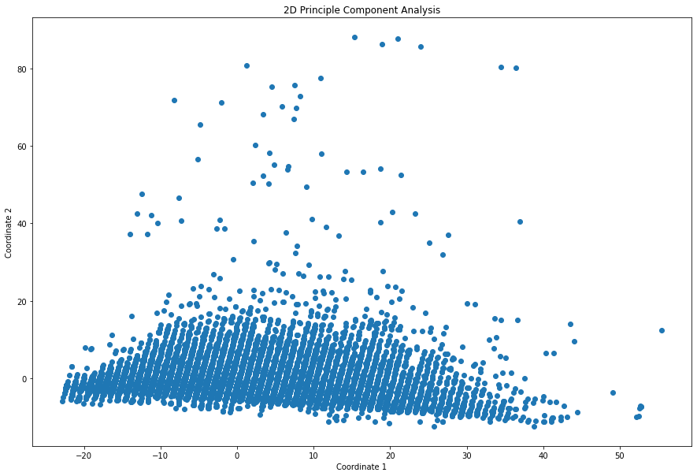
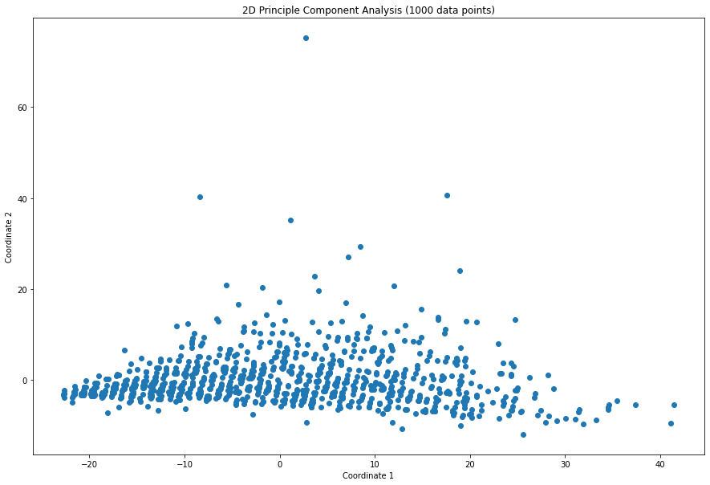
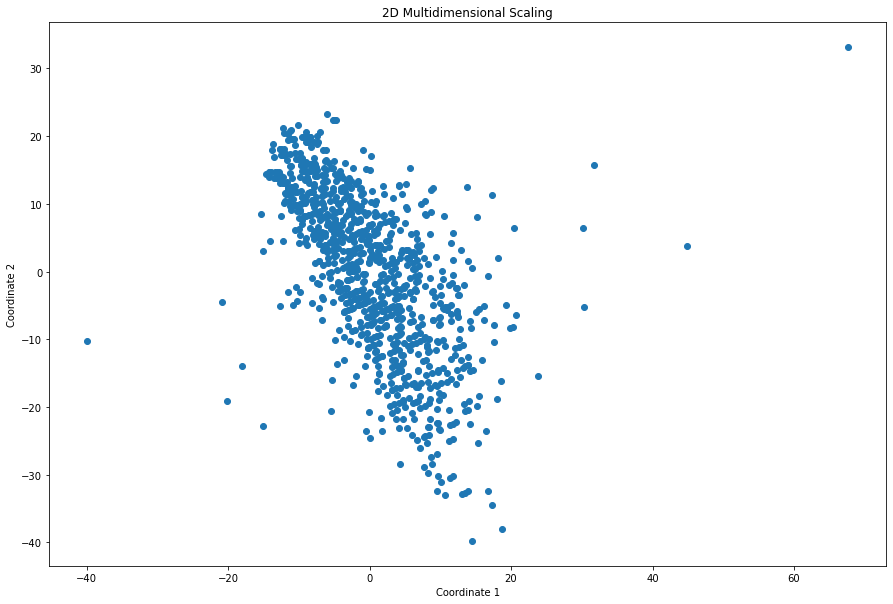
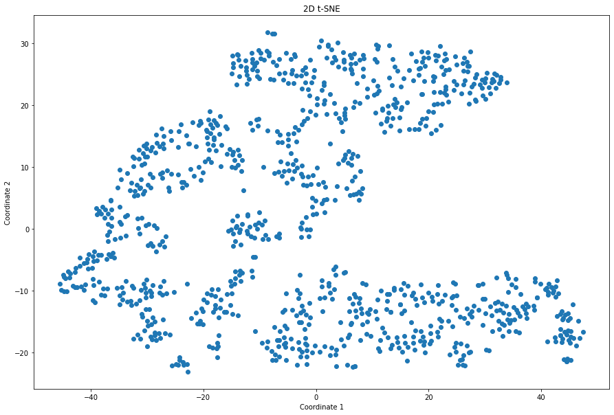
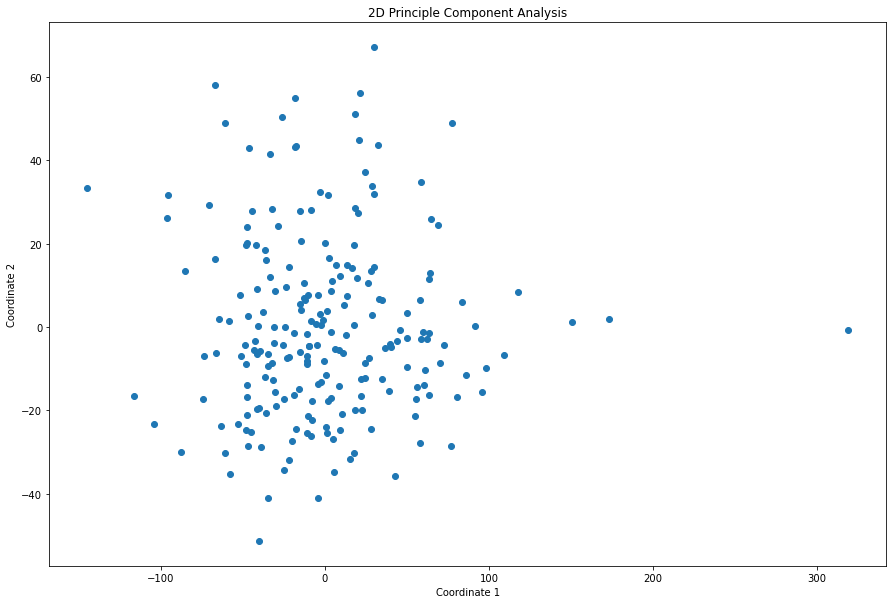
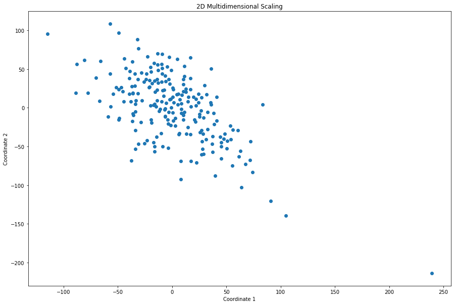
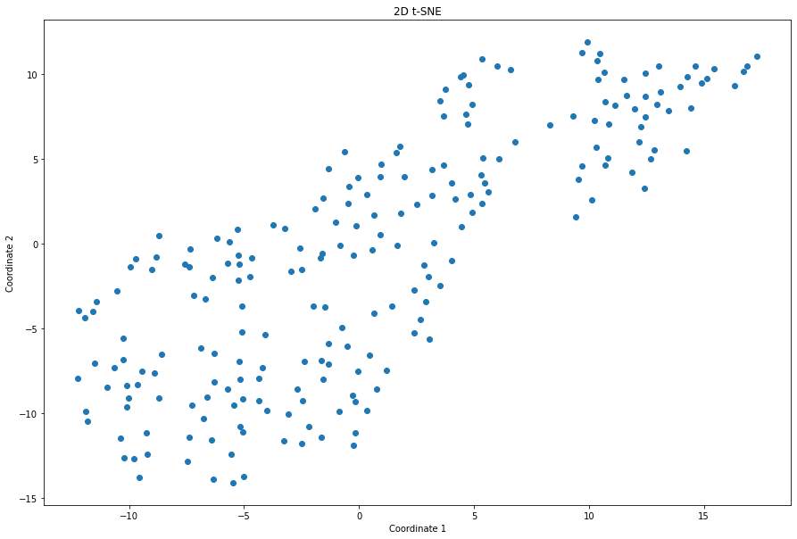

# Data Science Exercise 2

## Student: se21m024 Thomas Stummer 

# Big Dataset: Census Income

 
Data taken from:
 https://archive.ics.uci.edu/ml/datasets/Census-Income+%28KDD%29
  
Data Original Owner:
 U.S. Census Bureau
 http://www.census.gov/
 United States Department of Commerce
  
Donor:
 Terran Lane and Ronny Kohavi
 Data Mining and Visualization
 Silicon Graphics.
 terran '@' ecn.purdue.edu, ronnyk '@' sgi.com
  

## General information

The following 8 features were extracted from the data set. Categorical columns were converted to numbers and (elements with NaN values were dropped).

## Dimensionality Reduction Algorithms

### PCA

A basic two dimensional principle component analysis was performed. 
It can be seen that the variance along the coordinate 1 is higher than that of coordinate 2. For coordinate 2 only a few outliners are present. For coordinate 2 a relativly strict lower barrier seems to be present with very few and subtile outliners.

The principle component 1 accounts for 75.6% of the variance in the data set, whereas principle component 2 accounts for 17.6% of the variance. This sums up to 93.2%.

To make the result more comparable to the other two selected algorithms a second PCA was performed on the same subset of 1000 data points as for the other algorithms.

The plot suggests a similar overall structure of the data. The principle component 1 accounts for 76.9% of the variance in the data set, whereas principle component 2 accounts for 16.3% of the variance. This sums up to 93.2%. This is a light difference when compared to the full data set but not significant for the purpose of this inspection.

### MDS

For the MDS a subset of 1000 data points was taken form the original data set because otherwise the computation time would have exceeded acceptable limits. 
It can be seen that the variance along the coordinate 2 is higher than that of coordinate 1 (excluding outliners). For coordinate 1 only a few outliners are present. Comparing to the results of the PCA, the MDS also produces a projection where one component accounts for most of the variance. The diagrams seem to be rotated agains each over at about 60 degrees. A noticable difference is, that the MDS creates more outliners along the <i>weaker</i> coordinate (in this case coordinate 1 to the left) compared to the PCA (hardly any outliners after the barrier at the bottom.). The PCA plot also reveals a slight <i>brushed</i> distribution along coordinate 2 which is not present in the MDS plot.

### t-SNE

For the t-SNE a subset of 1000 data points was taken form the original data set because otherwise the computation time would have exceeded acceptable limits. This data points are the same ones as used for the MDS. 
The t-SNE produces a C-shaped projection with far more space between the individual data points compared to e.g. the MDS projection (with the same amount of data points) which results in a single cohesive cluster. While the PCA and the MDS seem to result in similar projections, the t-SNE clearly produces a very distinct projection in the two dimensional space. Futhermore the t-SNE projection suggests plenty of small to medium sized clusters in comparison to the other two algorithms.

## Comparison to analysis without dimensionality reduction

Investigating the results of the previous algorithms, I would say that the benefit of the dimensionality reduction lays in the ability to estimate the overall distribution and clustering of the data. With the <i>classical</i> approach applied in the first exercise, the distribution based on single features or the correlation between two or max. three features can be spotted but it does not indicate the overall clustering of the data. On the over hand, when projecting higher dimensional data into e.g. the two dimensional space, the correlation between individual features cannot be observed but insights in the overall structure of the data can be gained. This might be benefitial to select a specific cluster algorithm and estimate a first number of clusters for these algorithms. Summing up, it is very hard to spot specific correlations in the data when observing more than two or three features at once.

# Small Dataset: Heart Disease

 
Data taken from:
 https://archive.ics.uci.edu/ml/datasets/Heart+Disease
  
Data Creators: 
1. Hungarian Institute of Cardiology. Budapest: Andras Janosi, M.D. 
2. University Hospital, Zurich, Switzerland: William Steinbrunn, M.D. 
3. University Hospital, Basel, Switzerland: Matthias Pfisterer, M.D. 
4. V.A. MediMcal Center, Long Beach and Cleveland Clinic Foundation: Robert Detrano, M.D., Ph.D. 
  

## General information

todo:
The following 8 features were extracted from the data set. Categorical columns were converted to numbers and (elements with NaN values were dropped).

## Dimensionality Reduction Algorithms

### PCA

A basic two dimensional principle component analysis was performed. 
It can be seen

The principle component 1

To make

The plot suggests

### MDS

For

### t-SNE

For

## Comparison to analysis without dimensionality reduction

Investigating
