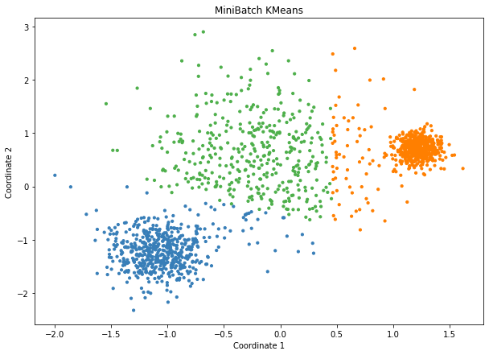
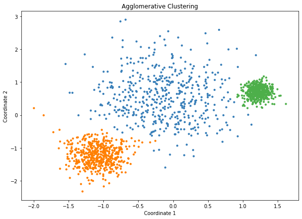
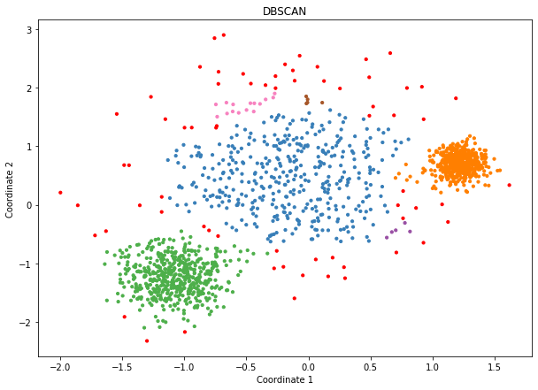
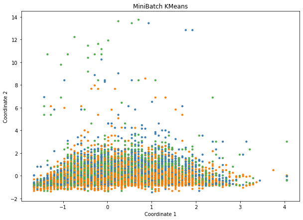
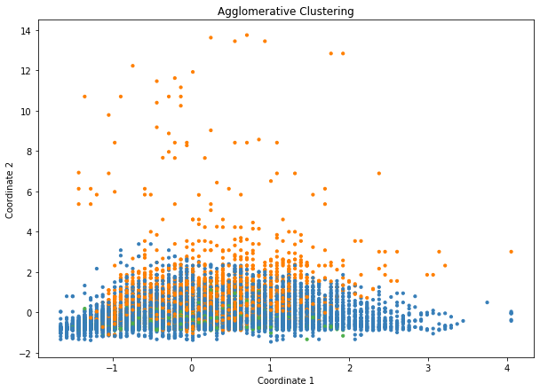
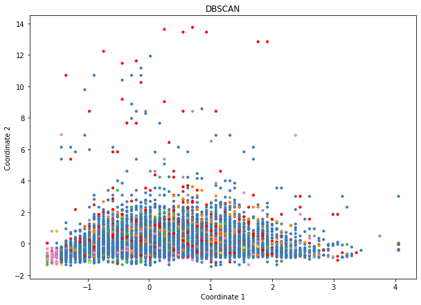
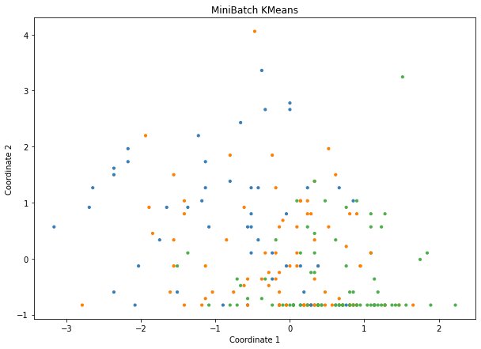
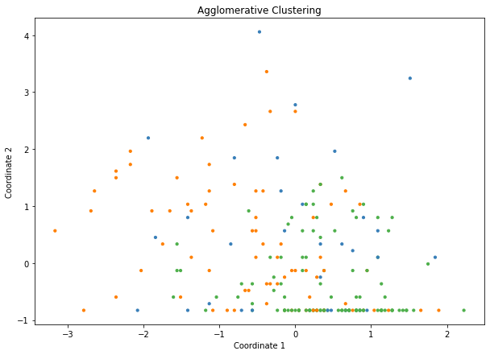
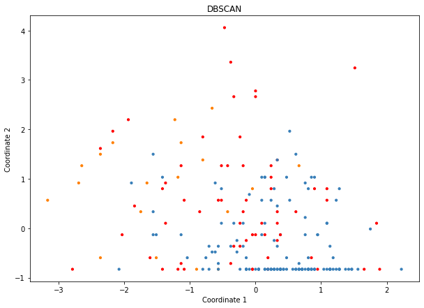

# Data Science - Exercise 3 - Clustering

## Student: se21m024 Thomas Stummer 

 

# Data Sets

## Toy Data Set

Data taken from: 
https://scikit-learn.org/stable/auto_examples/cluster/plot_cluster_comparison.html
  

## Big Data Set: Census Income

Data taken from:
 https://archive.ics.uci.edu/ml/datasets/Census-Income+%28KDD%29
  
Data Original Owner:
 U.S. Census Bureau
 http://www.census.gov/
 United States Department of Commerce
  
Donor:
 Terran Lane and Ronny Kohavi
 Data Mining and Visualization
 Silicon Graphics.
 terran '@' ecn.purdue.edu, ronnyk '@' sgi.com
  

## Small Data Set: Heart Disease

Data taken from:
 https://archive.ics.uci.edu/ml/datasets/Heart+Disease
  
Data Creators: 

1. Hungarian Institute of Cardiology. Budapest: Andras Janosi, M.D. 
2. University Hospital, Zurich, Switzerland: William Steinbrunn, M.D. 
3. University Hospital, Basel, Switzerland: Matthias Pfisterer, M.D. 
4. V.A. MediMcal Center, Long Beach and Cleveland Clinic Foundation: Robert Detrano, M.D., Ph.D.

# Algorithms

Three clustering algorithms were chosen based on the requirement to work with at least one partitive and one hierarchical algorithm and the fact that those algorithms seemed to be good based on the overview that can be found at the scikit learn platform https://scikit-learn.org/stable/auto_examples/cluster/plot_cluster_comparison.html :

- Mini-Batch k-Means (partitive)
- Agglomerative Clustering (hierarchical)
- DBSCAN (density based)

## Mini-Batch k-Means

For the required category of partitive clustering algorithms the Mini-Batch k-Means was selected because it is a variation of the k-Means that is suitable for large data sets. Small, randomly chosen batches are processed in each iteration instead of working on the whole data set at once.

## Agglomerative Clustering

For the required category of hierarchical clustering algorithms an agglomerative algorithm was chosen. It follows a bottom-up approach, meaning that all individual data points are assigned to an individual cluster, which are then conntected to one another in hierarchical manner to form a new cluster until only the desired amount of clusters remains.

## DBSCAN

The 'density-based spatial clustering of applications with noise' (DBSCAN) algorithm groups together data points that are closely located to one another. Points with no close neighbour points are detected and marked as outliers. This algorithm was chosen for this exercise because the density based approach seems to have the potential to find structures that the two previously mentioned algorithms do not. A density based alternative would have been the 'ordering points to identify the clustering structure' (OPTICS) algorithm. The DBSCAN was favored for this assignment because it is significantly faster due to the scikit learn overview referenced above.

# Clustering Results

Because the data projection exercise did not indicate a suitable number of clusters, various target numbers of clusters were tried. For the algorithms requiring a number of clusters beforehand an amount of three clusters was chosen. Two clusters seemed to be to coarse-grained but four and five clusters seemed to make it even harder to deduce a meaningful interpretation of the clustering calculated that three target clusters already do. E.g. with more than three target clusters the agglomerative algorithm on the big data set made it harder to distinguish visually between points belonging to one or another cluster.

#####################################
Todo: Describe the results, and what information you can obtain. Specifically, compare the outcomes of the different methods.
#####################################

## Toy Data Set

### Algorithm 1: Mini-Batch k-Means

### Algorithm 2: Agglomerative Clustering

### Algorithm 3: DBSCAN

## Big Data Set: Census Income

### Algorithm 1: Mini-Batch k-Means

### Algorithm 2: Agglomerative Clustering

### Algorithm 3: DBSCAN

## Small Data Set: Heart Disease

### Algorithm 1: Mini-Batch k-Means

### Algorithm 2: Agglomerative Clustering

### Algorithm 3: DBSCAN

# Todo: Quantitative Comparison

Todo: chose two evaluation criteria to compare the algorithms also quantitatively: illustrate the different characteristics of the clustering
