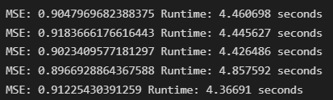
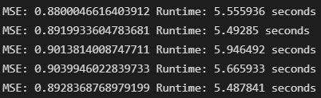
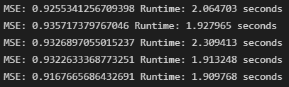
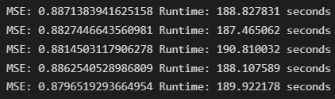
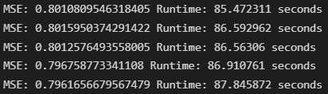
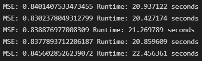

# Data Science Exercise 4 - Collaborative Filtering

 Student: se21m024, Thomas Stummer
  The source code can be found in the document <b><i>se21m024_Stummer_ex4_Coll_Filtering.ipynb</i></b>.
  
The data sets were provided by: 
F. Maxwell Harper and Joseph A. Konstan. 2015. The MovieLens Datasets:
History and Context. ACM Transactions on Interactive Intelligent
Systems (TiiS) 5, 4, Article 19 (December 2015), 19 pages.
DOI=http://dx.doi.org/10.1145/2827872
  
MovieLens 100k data set: https://grouplens.org/datasets/movielens/100k/
 
MovieLens 1m data set: https://grouplens.org/datasets/movielens/1m/
  

# Algorithms

The library <i>Surprise</i> (https://surprise.readthedocs.io/en/stable/index.html) including the example code of its online documentation was used to parameterize and train the algorithms as well as measuring their accuracy reached. 
These three clustering algorithms were chosen based on the assignments requirements:

- User Based Filtering (k-NN with means)
- Item Based Filtering (k-NN with means)
- Co-clustering

## k-NN with means

The k-NN with means algorithm uses the nearest neighbors approach and takes into account the mean ratings of each user.
It can be configured to be either user based or item based.
The maximum number of neighbors taking into account for aggregation were set to 40 and the minimum number of neighbors taken into account for aggregation was set to 1.
As similarity metric the cosine was used.

## Co-clustering

The co-clustering algorithm assigns clusters and co-clusters to users and items.
The number of user clusters as well as the number of item clusters was set to 3. The number of iterations for the optimization loop was set to 20.

# Results

The data sets were split into a training set (80%) and a test set (20%). 
The random seed for the shuffling was set to 21024 (student id: se21m024). 
The mean squared error (MSE) was used to determine the accuracy of the predictions. 
The splitting, training and testing was repeated 5 five times for every data set and every algorithm. 
To determine the efficiency of the algorithms the runtime required to train the models and perform the actual predictions was measured.

## 100k data set

User based filtering (k-NN with means)

  

Item based filtering (k-NN with means)

  

Co-clustering

## 1m data set

User based filtering (k-NN with means)

  

Item based filtering (k-NN with means)

  

Co-clustering

# Interpretation

## 100k data set

### Accuracy

For the 100k data set the user based filtering accomplished a MSE between 0.897 and 0.918.
The item based filtering accomplished a MSE between 0.88 and 0.904.
The co-clustering algorithm accomplished a MSE between 0.917 and 0.936.
Due to low MSE variance, the accuracy reached can be considered as quite stable for all three algorithms.

The item based approach reached the lowest minimum and maximum MSE measured. The co-clustering approach reached the highest minimum and maximum MSE measured.
Therefore the item based filtering can be said to be the most accurate algorithm under the given conditions and setups, followed by the user based filtering. The co-clustering approach performed worst.

### Efficiency

For the 100k data set the user based filtering required 4.397 to 4.856 seconds for training the model and generating the predictions.
The item based filtering required 5.488 to 5.947 seconds.
The co-clustering algorithm finished within 1.91 to 2.309 seconds.

As the maximum runtime of the co-clustering approach is lower than the minimum runtime of the user based approach and the maximum runtime of the user based approach is lower than the minimum runtime of the item based approach, the ranking of the algorithms regarding their efficiency is very clear. Even the variance in the runtimes of the individual algorithms has no effect on this ranking.
The co-clustering algorithm performs best with a big gap to both k-NN with means algorithms. The user based filtering performs better than the item based filtering.
If the number of iterations for the optimization loop of the co-clustering algorithm was set to a higher number, the accuracy could profit and its efficiency could tend more to the results of the k-NN based approaches. With further evaluation this hypothesis could be confirmed or disproven.

## 1m data set

### Accuracy

For the 1m data set the user based filtering accomplished a MSE between 0.880 and 0.887.
The item based filtering accomplished a MSE between 0.796 and 0.802.
The co-clustering algorithm accomplished a MSE between 0.830 and 0.846.
As expected, the variance of the MSE is lower for the 1m data set compared to the 100k data set for all three algorithms.

Similar to the 100k data set, the item based approach delivers the lowest minimum and maximum MSE for the 1m data set. Because there are no intersections between the MSE ranges of the different algorithms this is obviously true for the average mean squared errors (based on all 5 splits) as well. In contrast to the 100k data set the co-clustering algorithm reaches better results than the user based approach for the 1m data set.

### Efficiency

For the 1m data set the user based filtering required 187.5 to 190.8 seconds for training the model and generating the predictions.
The item based filtering required 85.5 to 87.8 seconds.
The co-clustering algorithm finished within 20.4 to 22.5 seconds.

Regarding the runtime needed to train the model and calculate the predictions the hierarchy of the three algorithms is very clear. The co-clustering approach requires by far the least amount of time whereas the user based approach requires the greatest amount of time. This is remarkable because on the 100k data set, the user based filtering performed better than the item based filtering. On the 1m data set these two algorithms swapped places. This could be due to the fact that the ratio of users to items in the 1m data set is more towards items (1000 users on 1700 movies) and more towards users in the 100k data set (6000 users on 4000 movies). This indicates that when picking an algorithm for collaborative filtering the concrete data set should be taken into consideration.
