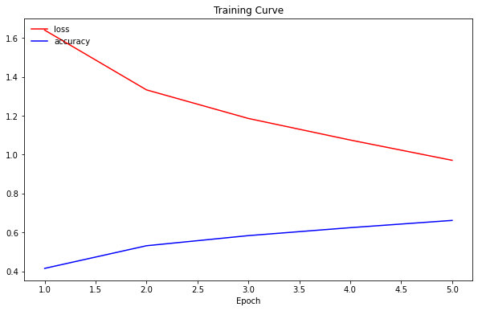
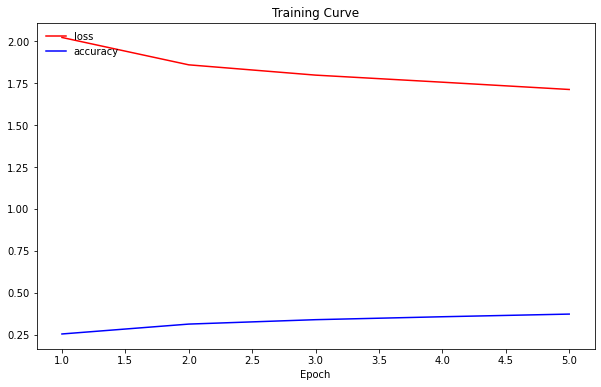

# Machine Learning

# Exercise 4 - Deep Learning

 Student:
 se21m024
 Matriculation number: 1425616
 Thomas Stummer
  The source code of the data can be found in the document <b><i>se21m024_Stummer_ml_ex4_deep.ipynb</i></b>.
  
The source code was heavily inspired by https://github.com/tuwien-musicir/DeepLearning_Tutorial/ and the code snippets provided by https://www.cs.toronto.edu/~kriz/cifar.html.
  

## 1. Data Set: CIFAR-10

The data set used for this exercise is the CIFAR-10 data set. 
Description taken from https://www.cs.toronto.edu/~kriz/cifar.html: 
"The CIFAR-10 dataset consists of 60000 32x32 colour images in 10 classes, with 6000 images per class. There are 50000 training images and 10000 test images. The dataset is divided into five training batches and one test batch, each with 10000 images. The test batch contains exactly 1000 randomly-selected images from each class. The training batches contain the remaining images in random order, but some training batches may contain more images from one class than another. Between them, the training batches contain exactly 5000 images from each class. The classes are completely mutually exclusive." 
CIFAR-10 python version downloaded from https://www.cs.toronto.edu/~kriz/cifar-10-python.tar.gz 
Reference: Learning Multiple Layers of Features from Tiny Images, Alex Krizhevsky, 2009.

### 1.1. Data perparation

The downloaded data files were unpickled:

- 5 files containing 10.000 image each for trainig
- 1 file containing 10.000 images for testing

The images were represented as an array with a length of 3072 elements (one for each pixel and RGB channel).

The labels were extracted and converted to categories.

The image data was then standardized via zero-mean unit-variance (deduct the mean and divide by the standard deviation).

## 2. Fully Connected Neural Network

### 2.1. Architecture

The architecture was initially taken from the configuration in https://github.com/tuwien-musicir/DeepLearning_Tutorial/blob/master/Car_recognition.ipynb. The architecture was not changed because it seemed to be a appropriate base line considering the architecture of the convolutional neural network with a hidden layer of 128 neurons (see below). After testing with 128 neurons in the hidden layers (which achieved comparable results), I switched back to 256 neurons because they performed slightly better and the training time did not increase significantly.

- Hidden Layer 1: 256 neurons
- Hidden Layer 2: 256 neurons with Sigmoid activation function
- Output Layer: 10 neurons with Softmax activation function

Total number of parameters: 855.050

### 2.2. Training and Prediction

The fully connected neural network was trained with the 50.000 images of the training sample with the following parameters:

- Loss function: categorical_crossentropy because it is a multi class problem
- Optimizer: Stochastic Gradient Descent
- Metric: Accuracy
- Batch Size: 32
- Epochs: 5

The batch size as well as the number of epochs was fixed for all tests to make the results more comparable.

### 2.3. Results

The accuracy reached on the training set was 0.47206.
The accuracy reached on the test set was 0.4498.

## 3. Convolutional Neural Network

### 3.1. Data perparation

For the convolutional neural network the image data had to be reshaped from the previous dimensions (number_of_samples, 3072) to (number_of_samples, 32, 32, 3) where 32 are the width and height of each image and 3 being the number of color channels.

### 3.2. Architecture

The architecture taken for the convolutional neural network was proposed in this kaggle notebook: https://www.kaggle.com/code/vassiliskrikonis/cifar-10-analysis-with-a-neural-network/notebook.

The neural network constists of the following parts:

- 3 identical convolution layers with the following parameters (after each convolution layer, a dropout of 0.2 was applied):
  - 64 filters
  - Kernel Size: 3 x 3 pixels
  - Activation Function: Rectified Linear Unit (ReLU)
- Hidden layer with 128 neurons and a ReLU activation function
- Output Layer with 10 neurons and a Softmax activation function

Total number of parameters: 5.614.858

### 3.3. Data Augmentation

To increase the number of samples in the training set a data generator provides additional images by rotating, shiftig, flipping and scaling the original images.
To utilize data augmentation a image data generator with the following parameters was used:

- Rotation Range: 20
- Width Shift Range: 0.2
- Height Shift Range: 0.2
- Zoom Range: 0.2
- Horizontal Flip

### 3.4. Training and Prediction

The fully connected neural network was trained with the 50.000 images of the training sample with the following parameters:

- Loss function: categorical_crossentropy because it is a multi class problem
- Optimizer: Stochastic Gradient Descent
- Metric: Accuracy
- Batch Size: 32
- Epochs: 5

The batch size as well as the number of epochs was fixed for all tests to make the results more comparable.

### 3.5. Results

<b>Without Data Augmentation:</b> 
Accuracy on test set: 0.6364

It can be observed that the highest increase in accuracy (and highest decrease in loss) took place with the second training epoch. After that followed a nearly linear trend. If the number of epochs was increased beyond the fixed value of 5, a further increase in accuracy might have been possible.

<b>With Data Augmentation:</b> 
Accuracy on test set: 0.3495

The structure of the functions of accuracy and loss appears to be very similar to the functions without data augmentation. With the second training epoch the highest change towards higher accuracy was achieved, followed by a very weak linear trend.

## 4. Analysis of Results

As minimum base line an accuracy of 0.1 can be proposed because the images are distributed evenly among 10 classes (each of the 10 classes of the test set contains 1000 images).

With an accuracy of 0.6364 on the test set the convolutional neural network performed significantly faster than the simple fully connected network with an accuracy of only 0.4498. While the simple network could be trained within about 25 seconds, the convolutional network required around 15 minutes to be trained with the same number of epochs and the same batch size. 
Surprisingly, when adding augemntated data, the convolutional neural network's accuracy decreased with a result of 0.3495 which is even worse than the result of the simple fully connected neural network. When obsering the training curves, it appears to be possible that the data augemented apporach would only lead to better results with a higher number of epochs, as the learning curve of the data augmented training is more flat than the one without data augmentation.
